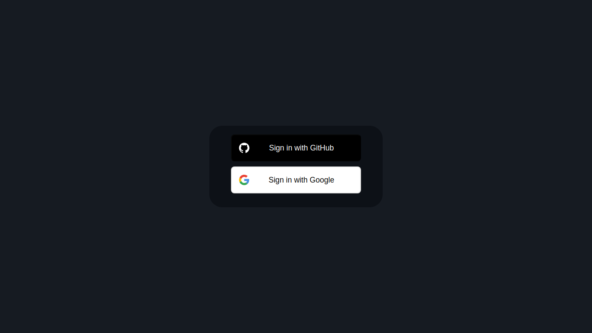
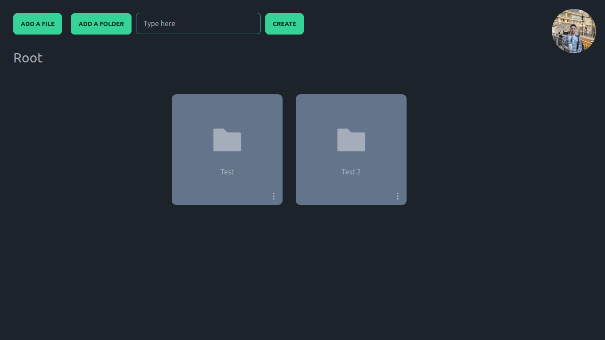
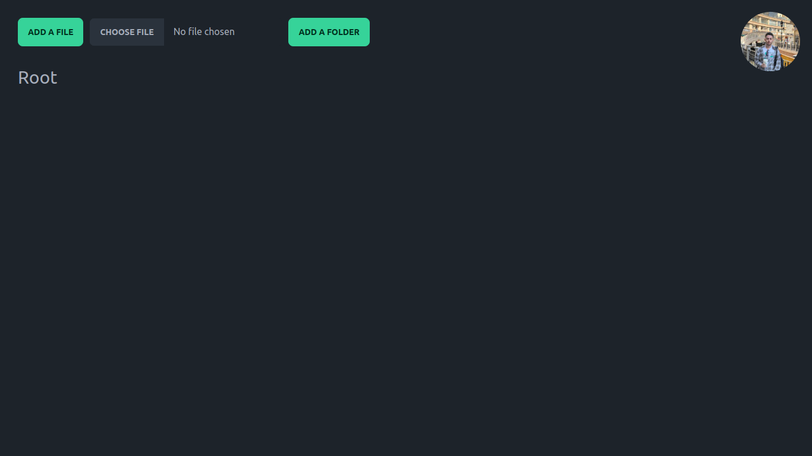
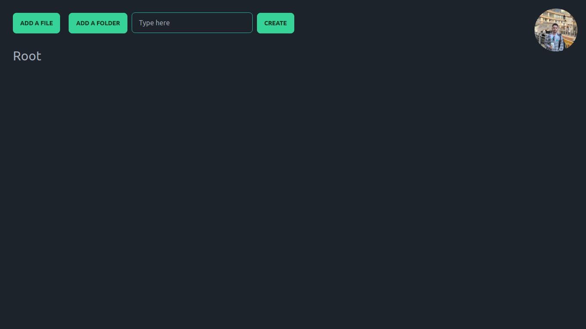

This is Google Drive Clone with the capability of creating folder, uploading files and authentication.

For this project we use ReactJs Library and Next.Js Framework with TypeScript. 

We also use Sass, Daisyui(Tailwind Component), Firebase.

Hope you like it!

